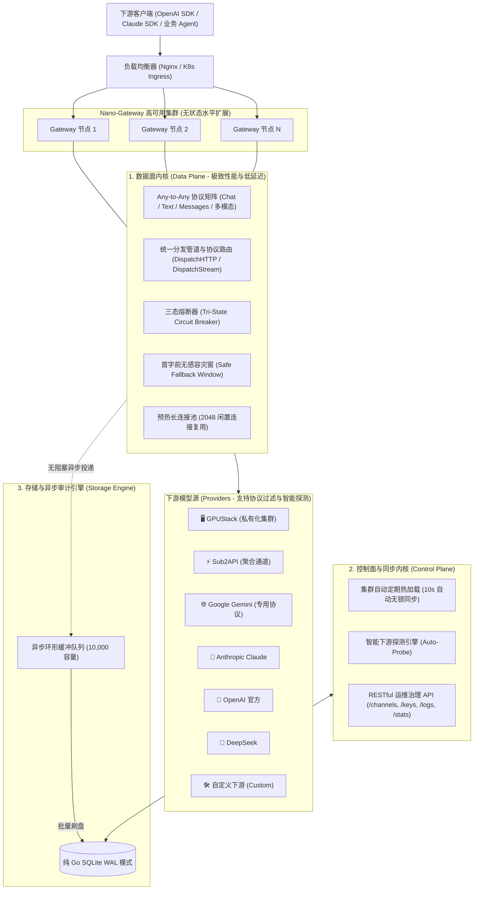

# Nano-Gateway 🚀

[](https://github.com/ifnodoraemon/nano-gateway/actions/workflows/ci.yml)
[](https://github.com/ifnodoraemon/nano-gateway/actions/workflows/docker.yml)
[](LICENSE)
[](https://goreportcard.com/report/github.com/ifnodoraemon/nano-gateway)

生产级、极速并发、极致高可用且高韧性的企业级 LLM 与全模态智能网关。从零以 Go 语言构建，原生支持 **Any-to-Any 协议矩阵**、**级联模型源 (Cascading Providers)**、**下游智能探测 (Auto-Probe)** 与 **全双工协议自动转译**。

彻底解耦 **数据面 (Data Plane - 极致并发转发内核)** 与 **控制面 (Control Plane - 运维治理内核)**，单二进制内嵌 **现代化明亮控制台 (React 19 + Tailwind CSS Web UI)**。

---

## 📚 完整文档索引 (Documentation)

- [📖 API 接口详尽参考手册 (API Reference)](docs/API_REFERENCE.md)
- [⚙️ 系统全量配置与调优指南 (Configuration & Tuning)](docs/CONFIGURATION.md)
- [🔌 供应商与下游对接指南 (Provider Integration Guide)](docs/PROVIDER_GUIDE.md)
- [🛡️ 高可用集群与容灾部署架构 (HA Architecture)](docs/HA_ARCHITECTURE.md)

---

## 🌟 核心特性与架构优势

### 1. 🔍 一键智能探测下游服务 (Downstream Auto-Probe)
- 只需输入下游服务的 Base URL 与可选 API Key，网关后台**毫秒级探测并自动读取**：
  - 自动发现所有挂载模型 ID；
  - 自动识别厂商类型（GPUStack、Sub2API、Google Gemini、Anthropic Claude、vLLM、Ollama）；
  - 自动匹配并勾选下游支持的协议与模态（对话、生图、TTS、Whisper、视频）；
  - 彻底免去用户手动配置模型列表与协议的繁琐操作。

### 2. 🔄 全双工协议自动转译 (Bidirectional Protocol Translation)
- **纯补全下游自动适应**：当下游模型仅支持传统的 `/v1/completions` 接口时，网关透明地将入站的 Chat 请求与 SSE 流转译为补全 Prompt，并将响应包装回标准 Chat Choices 与 SSE Deltas。
- **Claude 原生双向互转**：客户端可直接使用原生 Anthropic SDK 请求 `/v1/messages`，网关自动将请求转化为 OpenAI / Gemini 格式，并在返回时转换为 Claude Messages 协议。
- **Gemini 原生格式转译**：官方 Gemini Developer API 专用协议透明转译，支持多模态多轮会话。

### 3. 🎨 文本/图像/语音/视频全模态支持 (Unified Multimodal Pipeline)
- **对话与补全**：`/v1/chat/completions`, `/v1/completions`, `/v1/messages`
- **AI 图像生成**：`/v1/images/generations`（DALL-E 3、Flux、SD3）
- **语音合成 TTS**：`/v1/audio/speech`（流式二进制直连，零常驻内存）
- **语音识别 STT**：`/v1/audio/transcriptions`（Whisper Multipart 流式转录）
- **视频生成与轮询**：`/v1/videos/generations`, `/v1/videos/tasks/:id`（Sora / CogVideoX 异步任务轮询）
- 所有模态均采用**软件工程 Strategy 统一管道 (`DispatchHTTP`)**，共享三态熔断与安全容灾。

### 4. 🔗 级联模型源与无限制模型命名 (Cascading Models & Namespaces)
- **多层级斜杠无限制支持**：下游模型形如 `xxx/xx`，对外可任意包装为 `yy/xxx/xx`、`org/team/project/model` 或任意级联路径，网关不设任何层级限制。
- **通配符前缀映射 (Prefix Wildcards)**：支持配置 `"yy/*": "*"` 或 `"org/dept/*": "*"`，自动完成前缀剥离与转发重写。
- **自动渠道名称前缀匹配**：当请求模型形如 `<provider_name>/<upstream_model>` 时，网关自动定位该 Provider 并透明透传 `<upstream_model>`。

### 5. ⚡ 极致性能与零延迟 (Extreme Performance)
- **代理热路径零数据库查询 (Zero-DB Hot Path)**：路由表与密钥常驻内存读写锁结构，微秒级路由决策（$< 50\mu s$），0 次 SQL 查询。
- **预热长连接池 (HTTP Transport Pool)**：预热 2048 个复用连接、单 Host 256 并发长连接、HTTP/2 多路复用，杜绝 TCP 握手开销。
- **异步环形缓冲审计日志器 (AsyncLogger)**：10000 容量缓冲队列，500ms 批量异步持久化入库，慢磁盘 IO 绝不拖累转发延迟。

### 6. 🛡️ 极致高可用与容灾 (Extreme High Availability)
- **三态智能熔断器 (Tri-State Circuit Breaker)**：每个 Provider 独立跟踪健康度。发生 3 次连续故障（500/429/超时）即刻熔断 30 秒，旁路死节点避免雪崩；冷却后自动进行半开探活与自愈。
- **首字前无感容灾窗 (Safe Fallback Window)**：在首个有效 Token 或完整结果返回前遇到上游异常，毫秒级无缝漂移到下一个优先级 Provider，客户端业务完全无感知。
- **集群 10 秒定期无锁自同步**：任意实例修改配置，多副本集群后台自动热重载，无需人工重启服务。

---

## 🏛️ 系统架构图



---

## 🚀 极速部署指南

### 方式 A: 预编译二进制直接运行
```bash
# 1. 编译自包含单二进制（包含内嵌 Web UI）
make build

# 2. 启动网关
./bin/nano-gateway -config configs/config.yaml
```
- 控制台地址：`http://localhost:8080/ui/`
- Prometheus 指标：`http://localhost:8080/metrics`
- 健康检查：`http://localhost:8080/health`

### 方式 B: Docker Compose 多副本高可用集群
```bash
# 一键启动 2 副本 Gateway + Nginx 负载均衡器
docker compose up -d --build
```
Nginx 会自动在 `http://localhost:80` 暴露统一入口，并以 `least_conn` 算法向双节点分发流量，自动关闭 SSE 缓冲 (`proxy_buffering off`)。

### 方式 C: Kubernetes Helm Chart 部署
```bash
# 使用 Helm 一键部署至 K8s
helm install nano-gateway ./helm/nano-gateway -n gateway --create-namespace
```

---

## 🧪 自动化测试体系

所有 19 个端到端及单元测试套件均在并发竞态检测 (`-race`) 模式下自动化运行：
```bash
make test
```
包含：
- API 健康度与 Prometheus `/metrics` 校验
- 控制面动态 CRUD 与数据面热重载
- 级联模型命名与通配符前缀剥离 (`TestCascadingAndUnrestrictedModelMapping`)
- 三态智能熔断器状态机跃迁 (`CLOSED -> OPEN -> HALF-OPEN -> CLOSED`)
- 首字前无感容灾窗口（非流式与流式）
- Google Gemini 协议与 Anthropic Claude 双向流式转换
- 多模态生图、TTS、Whisper STT 与视频生成管道
- 纯文本补全下游全双工协议转译与智能探测 (`TestAutoProbe_OpenAIAndGPUStack`)

---

## 📄 开源许可证

本项目基于 [MIT 许可证](LICENSE) 开源。
