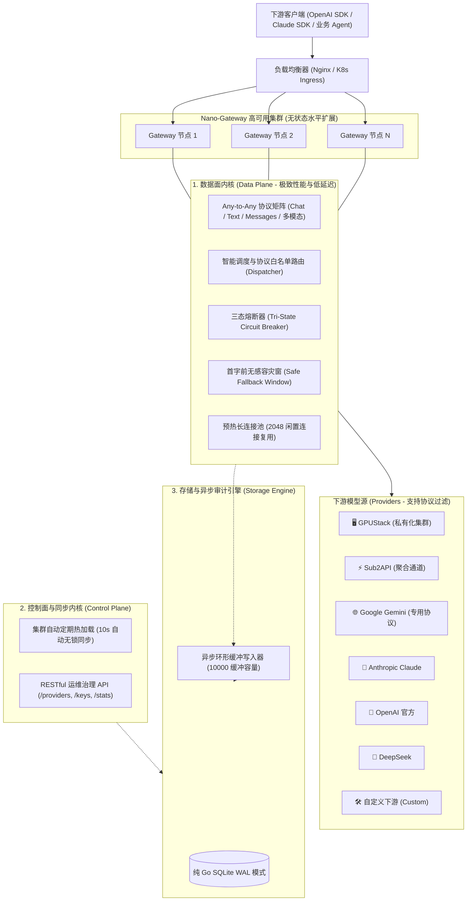

# Nano-Gateway 🚀

生产级、极速并发、极致高可用且高韧性的 LLM 智能网关。从零以 Go 语言构建，原生支持 **Any-to-Any 协议矩阵** 与 **级联模型源 (Cascading Providers)**。

彻底解耦 **数据面 (Data Plane - 极致并发转发内核)** 与 **控制面 (Control Plane - 运维治理内核)**，单二进制内嵌 **现代化明亮控制台 (React 19 + Tailwind CSS Web UI)**。

---

## 🌟 核心特性与架构优势

### 1. 级联模型源与无限制模型命名 (Cascading Models & Namespaces)
- **多层级斜杠无限制支持**：下游模型形如 `xxx/xx`（例如 `meta-llama/Llama-3.1-8B-Instruct` 或 `deepseek-ai/DeepSeek-V3`），对外可任意包装为 `yy/xxx/xx`、`org/team/project/model` 或任意级联路径，网关不设任何层级限制。
- **通配符前缀映射 (Prefix Wildcards)**：支持配置 `"yy/*": "*"` 或 `"cascade/*": "upstream/*"`，自动完成前缀剥离与转发重写。
- **自动渠道名称前缀匹配**：当请求模型形如 `<provider_name>/<upstream_model>` 时，网关自动定位该 Provider 并透明透传 `<upstream_model>`。

### 2. 丰富的第一公民模型源 (First-Class Providers)
- **🖥️ GPUStack 原生支持**：一键接入私有化算力池，原生对接 `/v1-openai`、`/v1`。
- **⚡ Sub2API 聚合网关**：内置快速预设，一键聚合多上游算力。
- **🌐 Google Gemini 专用适配**：支持 Gemini Developer API 的 `?key=` 与 `x-goog-api-key`、`contents/parts` 多模态多轮对话及 `BLOCK_NONE` 安全放行。
- **🧠 Anthropic Claude 双向转换**：入站出站任意互转（OpenAI 格式与 Claude `/v1/messages`）。
- **🤖 OpenAI 官方 / 🚀 DeepSeek / 💻 vLLM / SGLang / Ollama / 🛠️ 自定义下游 (Custom)**。
- **自选下游支持协议**：每个 Provider 可自由勾选开放的下游协议（OpenAI Chat、OpenAI Text、Claude Messages），调度器自动进行协议感知路由。

### 3. 极致性能与零延迟 (Extreme Performance)
- **代理热路径零数据库查询 (Zero-DB Hot Path)**：路由表与密钥常驻内存读写锁结构，请求在微秒级完成路由决策（$< 50\mu s$），0 次 SQL 查询。
- **预热长连接池 (HTTP Transport Pool)**：预热 2048 个复用连接、单 Host 512 并发长连接、HTTP/2 多路复用，杜绝 TCP 握手开销与 `TIME_WAIT` 端口耗尽。
- **异步环形缓冲审计日志器 (AsyncLogger)**：10000 容量缓冲队列，500ms 批量异步持久化入库，慢磁盘 IO 绝不拖累转发延迟。

### 4. 极致高可用与容灾 (Extreme High Availability)
- **三态智能熔断器 (Tri-State Circuit Breaker)**：每个 Provider 独立跟踪健康度。发生 3 次连续故障（500/429/超时）即刻熔断 30 秒，旁路死节点避免雪崩；冷却后自动进行半开探活与自愈。
- **首字前无感容灾窗 (Safe Fallback Window)**：在首个有效 Token 或完整结果返回前遇到上游异常，毫秒级无缝漂移到下一个优先级 Provider，客户端业务完全无感知。
- **集群 10 秒定期无锁自同步**：任意实例修改配置，多副本集群后台自动热重载，无需人工重启服务。
- **平滑优雅停机 (Graceful Shutdown)**：收到 `SIGTERM` 启动优雅排空，允许进行中的长连接 SSE 流式推流平滑完成。

---

## 🏛️ 系统架构图



---

## 🚀 快速开始与部署方式

### 方式 1：单二进制本地运行 (内置嵌入式 Web UI)

```bash
# 1. 编译 (自动编译 React 前端并嵌入 Go 单文件二进制)
make build

# 2. 运行网关
./bin/nano-gateway -config configs/config.yaml -db data/gateway.db
```

打开浏览器访问明亮管理控制台：👉 **`http://localhost:8080/ui/`**

---

### 方式 2：Docker Compose 多节点高可用集群部署

自带 Nginx 负载均衡器（已配置 `proxy_buffering off` 确保 SSE 流式零延迟）、双 Gateway 无状态节点与持久化数据卷：

```bash
# 一键拉起高可用集群
docker compose up -d

# 查看集群状态
docker compose ps
```

- **网关统一入口**：`http://localhost:8080`
- **控制台页面**：`http://localhost:8080/ui/`

---

### 方式 3：Kubernetes Helm Chart 生产级部署

专为生产环境量身定制的高可用 Helm Chart，支持多副本、HPA 自动扩缩容、存活探针就绪探针以及 Ingress SSE 配置：

```bash
# 1. 检查 Helm Chart 语法
helm lint ./helm/nano-gateway

# 2. 一键安装发布
helm install nano-gateway ./helm/nano-gateway \
  --set replicaCount=3 \
  --set ingress.enabled=true \
  --set ingress.hosts[0].host=gateway.example.com
```

---

## 📡 接口调用与级联示例

### 1. 级联模型调用 (支持 `yy/xxx/xx` 无限制命名)
```bash
curl -X POST http://localhost:8080/v1/chat/completions \
  -H "Content-Type: application/json" \
  -H "Authorization: Bearer sk-gw-admin-demo" \
  -d '{
    "model": "myorg/gpustack/meta-llama/Llama-3.1-8B-Instruct",
    "messages": [
      {"role": "user", "content": "你好，请介绍一下你自己！"}
    ],
    "stream": true
  }'
```

### 2. Claude 原生协议接入 (/v1/messages)
```bash
curl -X POST http://localhost:8080/v1/messages \
  -H "Content-Type: application/json" \
  -H "x-api-key: sk-gw-admin-demo" \
  -d '{
    "model": "claude-3-5-sonnet",
    "messages": [
      {"role": "user", "content": "Hello via Anthropic SDK!"}
    ],
    "max_tokens": 1024
  }'
```

### 3. 多模态视觉测试 (Vision)
```bash
curl -X POST http://localhost:8080/v1/chat/completions \
  -H "Content-Type: application/json" \
  -H "Authorization: Bearer sk-gw-admin-demo" \
  -d '{
    "model": "gemini-2.0-flash",
    "messages": [
      {
        "role": "user",
        "content": [
          {"type": "text", "text": "图中展示了什么？"},
          {"type": "image_url", "image_url": {"url": "https://example.com/demo.jpg"}}
        ]
      }
    ]
  }'
```

---

## 🧪 自动化测试套件

内置 14 套端到端测试用例，覆盖协议转换、熔断自愈、首字容灾、GPUStack 算力池与级联模型映射：

```bash
make test
# 输出: 14/14 PASS (go test -v -race ./...)
```
