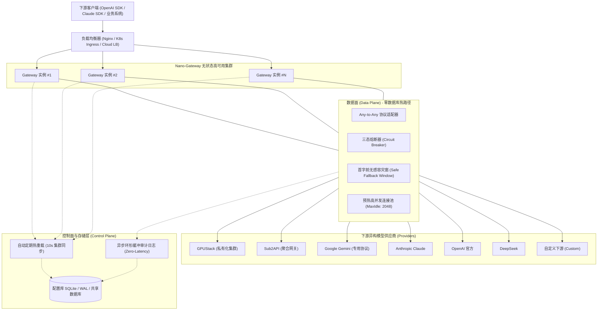

# Nano-Gateway 高可用 (HA) 与极致性能架构指南

本文档全面阐述 **Nano-Gateway** 如何在生产环境中实现 **极致稳定、极致性能与极致高可用**。

---

## 1. 架构总览与核心组件划分

Nano-Gateway 采用严格的 **数据面 (Data Plane)** 与 **控制面 (Control Plane)** 解耦架构：



---

## 2. 核心组件详解

| 核心组件 | 职责与技术实现 | 性能与高可用保障 |
| :--- | :--- | :--- |
| **Any-to-Any 协议适配器矩阵** | 统一入站（OpenAI Chat、OpenAI Text、Claude Messages、多模态）与异构出站（OpenAI, Gemini, Claude, GPUStack, Sub2API, Custom） | 流式 SSE 原生分块直通，零重复序列化，极低内存分配 |
| **智能调度器 (Dispatcher)** | 基于优先级 (Priority)、权重 (Weight) 及下游协议过滤 (`protocols`) 分发 | 纯内存路由查找，单次转发开销 `< 50 µs` |
| **三态熔断器 (Circuit Breaker)** | 管理每个 Provider 的健康状态：`Closed` (正常) / `Open` (熔断) / `Half-Open` (探活) | 上游连续故障 3 次即刻熔断 30 秒，秒级避开死节点，杜绝雪崩 |
| **首字无感容灾窗 (Safe Fallback)** | 在流式首个有效 Token 或非流式返回前拦截 5xx、429、超时的异常 | 毫秒级自动切换至同优先级/备用 Provider，客户端完全无感 |
| **预热 HTTP 连接池** | `MaxIdleConns: 2048`, `MaxIdleConnsPerHost: 512`, `KeepAlive: 60s` | 消除 TCP/TLS 频繁握手开销，彻底杜绝 TIME_WAIT 端口耗尽 |
| **控制面热加载同步器 (Synchronizer)** | 通过原子读写锁实现零数据库查找的路由缓存更新 | 数据库仅用于冷启动和后台同步，代理热路径 0 次 SQL 查询 |
| **异步环形缓冲审计日志器 (AsyncLogger)** | 10000 容量通道缓冲，500ms / 100 条批量异步持久化 | 审计写入与请求完全解耦，数据库慢查询绝对不影响网关 QPS |

---

## 3. 高可用 (HA) 多副本部署方案

### 3.1 无状态数据面横向扩容 (Horizontal Scalability)
- 网关实例本身为完全**无状态 (Stateless)** 进程。
- 任意节点崩溃，上层负载均衡器 (Nginx / K8s Ingress) 会自动进行 TCP/HTTP 摘除，流量瞬间转移到健康节点。
- 所有节点共享统一的数据存储（SQLite WAL 模式挂载持久盘，或集中式数据库）。

### 3.2 节点间配置自同步 (Periodic Auto-Sync)
- 每个网关节点在后台运行轻量级轮询同步线程 (`StartPeriodicSync`, 默认 10 秒)。
- 运维人员在任意节点或控制台修改 Provider 或 API Key 后，其他所有存活副本在 10 秒内自动拉取最新配置并无锁热更新内存状态，无需重启集群。

### 3.3 优雅停机与连接排空 (Graceful Shutdown)
- 收到 `SIGTERM` 或 `SIGINT` 时，网关启动 10 秒倒计时：
  - 停止接收新连接。
  - 允许当前正在进行的长连接 SSE 流式输出平滑完成。
  - 异步日志缓冲排空入库后退出。

---

## 4. Kubernetes 生产部署清单 (`deploy/kubernetes.yaml`)

```yaml
apiVersion: apps/v1
kind: Deployment
metadata:
  name: nano-gateway
  namespace: default
  labels:
    app: nano-gateway
spec:
  replicas: 3 # 3副本高可用部署
  selector:
    matchLabels:
      app: nano-gateway
  template:
    metadata:
      labels:
        app: nano-gateway
    spec:
      containers:
      - name: gateway
        image: nano-gateway:latest
        command: ["/app/nano-gateway", "-config", "/etc/nano-gateway/config.yaml", "-db", "/data/gateway.db"]
        ports:
        - containerPort: 8080
          name: http
        resources:
          requests:
            cpu: 500m
            memory: 512Mi
          limits:
            cpu: 4000m
            memory: 4Gi
        livenessProbe:
          httpGet:
            path: /health
            port: 8080
          initialDelaySeconds: 5
          periodSeconds: 10
        readinessProbe:
          httpGet:
            path: /health
            port: 8080
          initialDelaySeconds: 2
          periodSeconds: 5
        volumeMounts:
        - name: data-vol
          mountPath: /data
        - name: config-vol
          mountPath: /etc/nano-gateway
      volumes:
      - name: data-vol
        persistentVolumeClaim:
          claimName: nano-gateway-pvc
      - name: config-vol
        configMap:
          name: nano-gateway-config
---
apiVersion: v1
kind: Service
metadata:
  name: nano-gateway-svc
spec:
  type: ClusterIP
  selector:
    app: nano-gateway
  ports:
  - port: 8080
    targetPort: 8080
```

---

## 5. Nginx 高可用负载均衡配置 (`deploy/nginx.conf`)

```nginx
upstream nano_gateway_cluster {
    # 负载均衡算法：支持 least_conn 最小连接数
    least_conn;
    server 10.0.1.10:8080 max_fails=2 fail_timeout=10s;
    server 10.0.1.11:8080 max_fails=2 fail_timeout=10s;
    server 10.0.1.12:8080 max_fails=2 fail_timeout=10s;

    # 保持与网关节点的长连接
    keepalive 256;
}

server {
    listen 80;
    server_name gateway.internal.net;

    location / {
        proxy_pass http://nano_gateway_cluster;
        proxy_http_version 1.1;
        proxy_set_header Connection "";
        proxy_set_header Host $host;
        proxy_set_header X-Real-IP $remote_addr;
        proxy_set_header X-Forwarded-For $proxy_add_x_forwarded_for;

        # 核心：必须禁用代理缓冲以支持 SSE 流式推流
        proxy_buffering off;
        proxy_cache off;
        proxy_read_timeout 300s;
        proxy_send_timeout 300s;
    }
}
```
